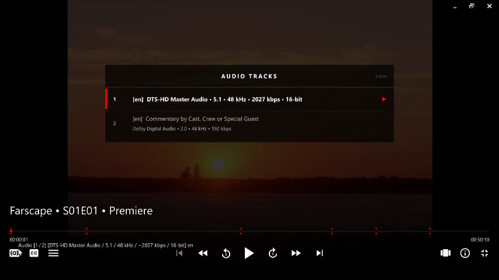

# ModernH


A clean, cinematic On-Screen Controller for [mpv](https://mpv.io/) with animated overlay menus, 
seekbar thumbnails, chapter & playlist navigation, and smart episode title parsing.

> **Based on [ModernX](https://github.com/cyl0/ModernX) by cyl0**, extended with overlay menus, chapter navigation, animated UI, and smart filename parsing.

---

## 📸 Preview

> **  
> 

---

## ❓ Why ModernH?

ModernH focuses on improving real-world usability over traditional OSC designs.

- Designed for real media libraries  
  Instead of cycling through options blindly, ModernH uses menu-based navigation — making it much easier to handle:
  - TV series with many episodes  
  - Files with multiple audio tracks  
  - Files with multiple subtitles  

- Cleaner and more consistent UI  
  All menus follow a unified design system for better readability and navigation

- More control, less friction  
  Direct selection replaces repetitive cycling, reducing clicks and confusion

If you want a more polished and unified UI than stock ModernX, ModernH is designed for that.

---

## 📋 Requirements

- **mpv 0.36 or newer**  
- **Lua scripting enabled** (default in mpv)  
- **thumbfast.lua** — required for seekbar thumbnails (included)

> Tested on mpv 0.41 (Windows, dev build).  
> Should work on mpv 0.36+.

---

## ✨ Features

- **Netflix-style bottom bar** — sleek gradient background, smooth fade in/out
- **Unified Menu Design** — all menus follow the same visual style, consistent spacing, typography, and layout
- **Animated overlay menus** *(menu-based navigation, no cycling)* — click any icon to open a dark panel overlay with fade animation and a smooth animated focus bar:
  - 📋 **Playlist** — browse and jump to any file; two-line layout for TV series (episode title on line 1, show name + S01E02 on line 2)
  - 🎵 **Audio Tracks** — shows language tag, codec, channel count, and sample rate
  - 💬 **Subtitles** — shows language and track title; includes an "Off" option
  - 📄 **Chapters** — timestamped chapter list; click any entry to jump directly

> **Note:** Menus support keyboard navigation (↑ ↓ Enter) and mouse click.  
> Mouse scroll wheel is not supported inside menus.
  
- **Smart title display** — automatically parses and cleans filenames for the title bar, Playlist and Audio track labels:
  - TV series → `Show Name • S01E03 • Episode Title`
  - Movies → `Movie Title (2023)`
  - Strips release junk: `1080p`, `BluRay`, `x265`, `WEB-DL`, `REMUX`, etc.
- **Seekbar thumbnail previews** — hover the seekbar to see a video frame preview (requires `thumbfast.lua`)
- **Chapter markers on the seekbar** — small triangles/ticks marks show where each chapter begins
- **Right-click seekbar** — jumps to the start of the chapter
- **Chapter skip buttons** — dedicated prev/next chapter buttons (auto-greyed when no chapters exist)
- **Clickable timecodes** — click the left time to toggle milliseconds; click the right time to toggle remaining vs. total duration

---

## 📁 Installation


> ⚠️ **Important**
> 
> Before installing ModernH, it's strongly recommended to **back up your existing mpv configuration folder**.
> 
> Your current setup (scripts, configs, fonts, etc.) may differ, and some settings in this project might not match your environment or preferences.
> 
> This is an early-stage release, so if something doesn't work as expected, you can easily restore your previous setup.
> 
> Example (Windows):
> ```
> %APPDATA%\mpv\
> ```

> 🔁 **Merging with your existing setup**
> 
> After copying the files, you don’t have to replace everything.
> 
> You can open your current mpv config and these files side by side, then:
> - keep what already works for you  
> - copy only the settings or scripts you need  
> - adjust values based on your preferences  
> 
> This way you can integrate ModernH without breaking your existing setup.


### Step 1 — Find your mpv config folder

| OS | Path |
|----|------|
| Windows | `%APPDATA%\mpv\` |
| Linux | `~/.config/mpv/` |
| macOS | `~/.config/mpv/` |


### Step 2 — Place all files exactly as shown below

```
mpv/
├── mpv.conf
├── input.conf
├── fonts/
│   └── Material-Design-Iconic-Font.ttf   ← Required for OSC icons
├── scripts/
│   ├── modernH.lua                        ← This custom OSC implementation
│   ├── thumbfast.lua                      ← Seekbar thumbnail previews
│   └── autoload.lua                       ← Auto-playlist from folder
└── script-opts/
    ├── osc.conf                           ← OSC behavior & appearance
    └── stats.conf                         ← Stats overlay style (i key)
```

> Create the `fonts/`, `scripts/`, and `script-opts/` subfolders if they don't exist yet.

### Step 3 — Disable the built-in OSC

Make sure `mpv.conf` contains:

```ini
osc=no
```

This disables mpv's built-in OSC so ModernH can replace it. ModernH also auto-disables it at runtime, but setting it explicitly prevents a brief flash on startup.

> **Note:** If you're using the `mpv.conf` included in this repo, this is already set — no action needed.

That's it. Launch mpv, play a file, and move your mouse to see the OSC.

---

## ⚙️ What Each File Does

| File | Role |
|------|------|
| `modernH.lua` | The OSC itself — draws the bar, menus, and buttons; parses titles; handles all interactions. Reads settings from `script-opts/osc.conf`. |
| `thumbfast.lua` | Generates and shows thumbnail previews when hovering the seekbar. Drop-in, no configuration needed. |
| `autoload.lua` | When you open a single file, silently loads all other compatible media from the same folder into a playlist so next/prev work. |
| `mpv.conf` | Main mpv settings — video quality, audio output, subtitles, cache, screenshots, OSD font. |
| `input.conf` | Keyboard and mouse bindings. Edit this to add or remap hotkeys. |
| `script-opts/osc.conf` | Options for ModernH: hide timing, seekbar style, which buttons to show, language, and more. |
| `script-opts/stats.conf` | Visual settings for the stats overlay (`i` key) — font and graph colors styled to match the OSC. |
| `fonts/Material-Design-Iconic-Font.ttf` | Icon font used by ModernH for all control buttons. **Required.** Without it, every button renders as an empty box. |

---

## 🎨 Customization

All OSC settings live in **`script-opts/osc.conf`**. The full list of options and their defaults is in the `user_opts` table at the top of `modernH.lua`.

### OSC options (`script-opts/osc.conf`)

```ini
# ── Visibility ────────────────────────────────────────────────────────────────
hidetimeout=800       # ms of no mouse movement before OSC hides (default: 1500)
                      # raise to e.g. 2000 if you want it to linger longer
fadeduration=200      # fade-out duration in ms — set to 0 for instant hide
showonpause=yes       # keep OSC visible when paused
showwindowed=yes      # show OSC in windowed mode
showfullscreen=yes    # show OSC in fullscreen mode

# ── Buttons ───────────────────────────────────────────────────────────────────
showtitle=yes         # show the parsed title above the seekbar
volumecontrol=no      # show mute button + volume slider (yes/no)
showjump=yes          # show ±jump buttons flanking play/pause
jumpamount=5          # jump duration in seconds (5, 10, and 30 get special icons)
jumpiconnumber=yes    # use numbered icons for 5/10/30s jumps

# ── Seekbar ───────────────────────────────────────────────────────────────────
seekbarhandlesize=0.3 # handle dot size, range 0.0–1.0 (smaller = cleaner look)
seekrange=yes         # show buffered range as a lighter fill on the seekbar
seekbarkeyframes=yes  # snap to keyframes while dragging for smoother scrubbing

# ── Time display ──────────────────────────────────────────────────────────────
timetotal=yes         # right timecode shows total duration (no = shows remaining)
timems=no             # show milliseconds by default

# ── Scaling ───────────────────────────────────────────────────────────────────
scalewindowed=1.0     # OSC scale when windowed
scalefullscreen=1.0   # OSC scale when fullscreen

# ── Language ──────────────────────────────────────────────────────────────────
language=eng          # eng (English), chs (Chinese Simplified), pl (Polish)
```

---

### Subtitle settings (`mpv.conf`)

```ini
sub-font="Segoe UI"       # font name or full path to a .ttf file
                          # e.g. sub-font="C:/Windows/Fonts/arial.ttf"
sub-font-size=38          # larger = easier to read
sub-margin-y=40           # distance from the bottom edge in pixels
sub-border-size=1         # outline thickness (0 = no outline)
sub-shadow-offset=1       # drop shadow depth (0 = no shadow)
```

### Volume settings (`mpv.conf`)

```ini
volume=70                 # starting volume on launch (0–150)
volume-max=150            # maximum scrollable volume
                          # set to 100 to disable volume boosting above 100%
```

### Screenshots (`mpv.conf`)

```ini
screenshot-format=png
screenshot-directory=~/Pictures/mpv
# Windows example:
# screenshot-directory=C:/Users/YourName/Screenshots
```

### OSD font (`mpv.conf`)

The OSD is the small status text mpv shows (volume level, seek position, etc.) — separate from subtitles.

```ini
osd-font=Segoe UI
osd-font-size=26
```

---

## ⌨️ Keybindings

Defined in `input.conf`. Edit this file to remap or add any bindings.

| Input | Action |
|-------|--------|
| Left click | Play / Pause |
| Double click | Toggle fullscreen |
| `←` / `→` arrow | Seek ±5 seconds |
| `↑` / `↓` arrow | Volume ±5 |
| Scroll wheel | Volume ±1 |
| **Seekbar** | |
| Left-click | Seek to position (exact) |
| Right-click | Snap to start of the chapter |
| Hover | Show thumbnail preview |
| **Timecodes (OSC)** | |
| Click left time | Toggle millisecond display |
| Click right time | Toggle remaining / total duration |
| **Overlay menus** | |
| Click playlist / audio / subtitle / chapter icon | Open that overlay menu |
| Click outside menu | Close menu |
| `i` / `I` | Toggle stats overlay |

> Full key name reference: https://mpv.io/manual/stable/#input-conf-syntax

---

## 📂 Autoload Behavior

`autoload.lua` automatically fills the playlist with all compatible media from the same folder whenever you open a single file. This is what makes the next/prev playlist buttons functional across multiple files.

To customize it, create `script-opts/autoload.conf`:

```ini
# disabled=no            # yes = disable autoload entirely
# videos=yes             # include video files
# audio=yes              # include audio files
# images=no              # include image files
# same_type=yes          # only load files of the same type as the one you opened
# directory_mode=lazy    # lazy (default) | recursive (include subfolders) | ignore
# ignore_patterns=^~,^bak-   # comma-separated lua patterns to skip
```

> **Note:** Autoload only runs for local files. It won't activate for URLs or streams, and it skips if you already launched mpv with multiple files specified.


---

## ⚠️ Known Limitations

- Mouse scroll is not supported inside overlay menus (yet)
- Stats panel is not yet fully consistent with the main UI

---

## 🔧 Troubleshooting

**OSC buttons show as boxes or question marks**  
The icon font is missing or in the wrong place. Make sure `Material-Design-Iconic-Font.ttf` is inside the `fonts/` subfolder of your mpv config directory (not directly in the config root).

**No thumbnail previews on seekbar hover**  
Confirm `thumbfast.lua` is inside `scripts/`. Thumbnails require mpv 0.36+ and take a moment to generate on first hover — this is normal.

**Title still shows the raw filename**  
The parser handles the most common patterns (SxxExx, 4-digit years, common release tags). For unusual filenames you can override the format in `osc.conf`:
```ini
title=${media-title}   # use mpv's built-in metadata title instead
```

**Files not auto-loading into a playlist**  
Autoload only works for local files (not URLs). If you open mpv with multiple files already on the command line or drag a folder, it detects a manually built playlist and skips.

**Brief flash of the old OSC on startup**  
Add `osc=no` to `mpv.conf` if you haven't already. ModernH disables the built-in OSC at runtime, but without the `mpv.conf` setting it may flicker for one frame.

**Using Linux or macOS?**  
The included `mpv.conf` is tuned for Windows (`d3d11`, `wasapi`, `hwdec=auto-d3d11va-copy`). Replace those lines with:
```ini
# Linux
gpu-api=vulkan
ao=pipewire            # or pulse / alsa
hwdec=auto             # vaapi for AMD/Intel, nvdec for NVIDIA

# macOS
gpu-api=metal
ao=coreaudio
hwdec=videotoolbox
```

---

## 🙏 Credits

Based on ModernX, which is derived from mpv-osc-modern (LGPL v2.1).

- [ModernX](https://github.com/cyl0/ModernX) by **cyl0** — OSC base this script is built on  
- [mpv-osc-modern](https://github.com/maoiscat/mpv-osc-modern) by **maoiscat** — the original upstream  
- [thumbfast](https://github.com/po5/thumbfast) by **po5** — seekbar thumbnail previews  
- [autoload.lua](https://github.com/mpv-player/mpv/blob/master/TOOLS/lua/autoload.lua) — official mpv auto-playlist script  
- [Material Design Iconic Font](https://zavoloklom.github.io/material-design-iconic-font/) — icon font used for all OSC buttons  

---

## 🤝 Contributions
Contributions are welcome!

If you're interested in improving ModernH, help would be especially appreciated for:

- 🖱️ **Scroll support in long menus**  
  (e.g. large playlists or chapter lists)

- 📊 **Stats menu redesign**  
  Making it visually consistent with other ModernH menus
  
- ✨ **General UI/UX improvements**  
  Animations, layout refinements, or new ideas

If you have suggestions, improvements, or fixes — feel free to open an issue or submit a PR.

---

## 📄 License

This project includes code from other open-source projects under their respective licenses.  
See [LICENSE](LICENSE) for details.

---

## 💖 Support

If you enjoy ModernH and want to support its development, you can do so here:

[PayPal](https://www.paypal.me/HarkeshBhatia)

No pressure — just using and sharing the project is already appreciated.

---

## ⭐ Final Note

This is a personal refinement of ModernX, focused on:

- cleaner UI
- better usability
- consistent design

Expect occasional updates and improvements.
